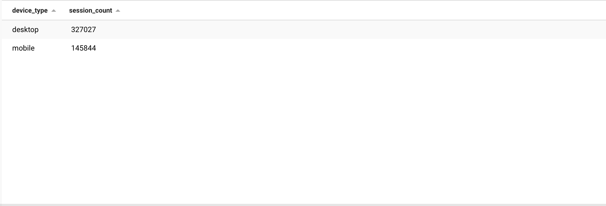
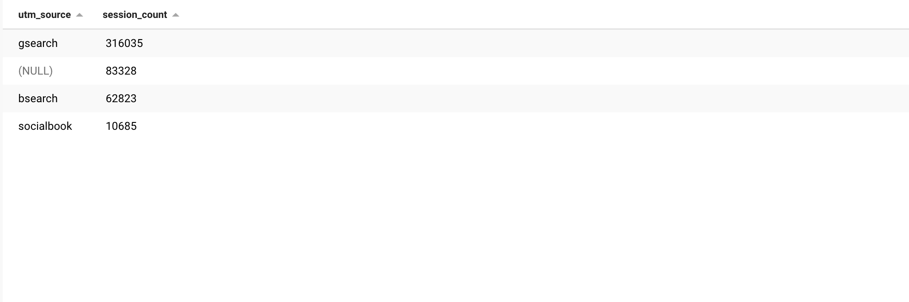
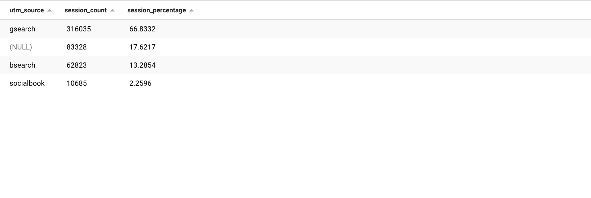
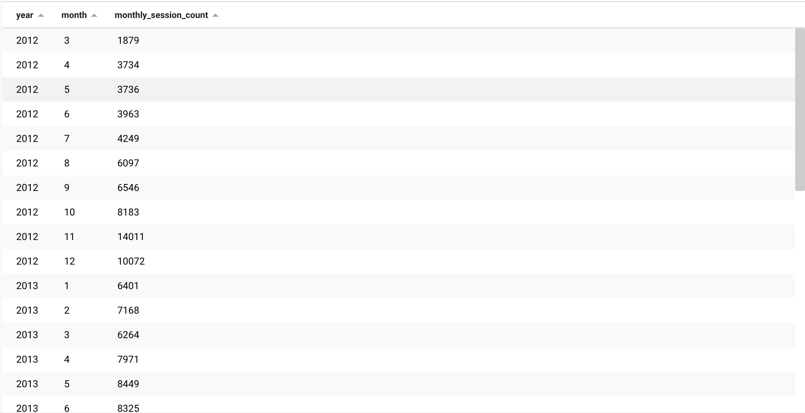
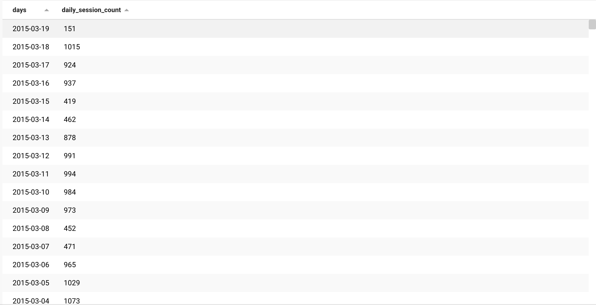
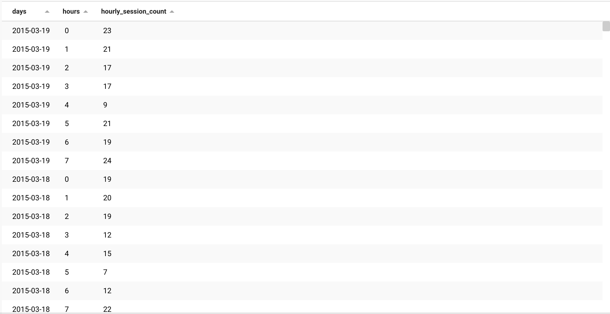
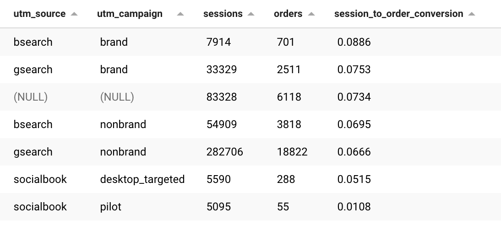

# E-Commerce Data Analysis

## Introduction
This project utilizies a e-commerce database for Maven Fuzzy Factory which can be found in [Kaggle](https://www.kaggle.com/datasets/rubenman/maven-fuzzy-factory-dataset).

The database contains six related tables with e-commerce data about:
- Website Activity
- Products
- Orders

The Entity Relationship Diagram(ERD) of the dataset is as following:


## Purpose
The purpose of this project is to analyze and get insights of user activity, sales and several other metrices from the e-commerce data. I will answer several questions from the data using SQL query.

## Questions & Answers:

### Web Session Analysis

* Session count per device type
```sql
SELECT device_type,
	COUNT(DISTINCT website_session_id) as session_count
FROM website_sessions
GROUP BY device_type;
```


* Session count per source
```sql
SELECT 
    utm_source,
    COUNT(DISTINCT website_session_id) as session_count
FROM website_sessions
GROUP BY utm_source;
```

- Highest number of sessions came from the source `gsearch` while more than 83,000 sessions do not have the source specified.

* Percetage of traffic coming from each source
```sql
SELECT 
    utm_source,
    COUNT(DISTINCT website_session_id) as session_count,
    (
     COUNT(DISTINCT website_session_id) 
     / 
     (SELECT COUNT(DISTINCT website_session_id) FROM website_sessions)
    ) * 100 as session_percentage
FROM website_sessions
GROUP BY utm_source
ORDER BY session_count DESC;
```

- Two-third of the total web traffic(66.8%) coming from one source `gsearch` followed by 13% from `bsearch` and ~2% from `socialbook`. However, more than 17% traffic does not have any source specified and should notify the corresponding team regarding this.


* Calculate monthly, daily and hourly user sessions
```sql
# Monthly session count:
SELECT 
    YEAR(created_at) as year, 
    MONTH(created_at) as month, 
    COUNT(DISTINCT website_session_id) as monthly_session_count
FROM website_sessions
GROUP BY YEAR(created_at), MONTH(created_at)
ORDER BY year, month;
```

```sql
# Daily session count:
SELECT 
    DATE(created_at) as days, 
    COUNT(DISTINCT website_session_id) as daily_session_count
FROM website_sessions
GROUP BY DATE(created_at)
ORDER BY days DESC;
```

```sql
# Hourly session count:
SELECT 
    DATE(created_at) as days, HOUR(created_at) as hours,
    COUNT(DISTINCT website_session_id) as hourly_session_count
FROM website_sessions
GROUP BY DATE(created_at), HOUR(created_at)
ORDER BY days DESC, hours;
```

- Every year in the months of November & December the web traffic increases. Also from year 2013 an increased traffice is seen in February.

### Traffic to Order Conversion Analysis
```sql
SELECT
  w.utm_source,
  w.utm_campaign,
  COUNT(DISTINCT w.website_session_id) AS sessions,
  COUNT(DISTINCT o.order_id) AS orders,
  COUNT(DISTINCT o.order_id) / COUNT(DISTINCT w.website_session_id) session_to_order_conversion
FROM
  website_sessions w
  LEFT JOIN orders o on w.website_session_id = o.website_session_id
GROUP BY
 w.utm_source,
 w.utm_campaign
ORDER BY
 session_to_order_conversion DESC;
 ```


- Bsearch utm_source with brand utm_campaign has the most session to order conversation rate of 8.86% 
- Gsearch – brand and organic/direct search. Socialbook-desktop_targeted 
- Socialbook-pilot has the lowest, so it can be a good idea to decrease the budget for those campaigns.

```sql
# Quarterly session to order conversation rate:
SELECT
YEAR(w.created_at) AS years,
    QUARTER(w.created_at) AS quarters,
    COUNT(DISTINCT o.order_id)/COUNT(DISTINCT w.website_session_id) AS session_to_order_conversion,
    ROUND(SUM(price_usd)/COUNT(DISTINCT o.order_id),2) AS revenue_per_order,
    ROUND(SUM(price_usd)/COUNT(DISTINCT w.website_session_id),2) AS revenue_per_session
FROM
    website_sessions w LEFT JOIN orders o ON w.website_session_id = o.website_session_id
GROUP BY YEAR(w.created_at),QUARTER(w.created_at)
ORDER BY years,quarters;
```
- The session to order conversation looks great for the business as it has grown from 3.2% since starting the business in 2012 to 8% in the most recent quarter of 2015. 
- Similarly, we see a drastic increase in revenue per order and revenue per session as well.

